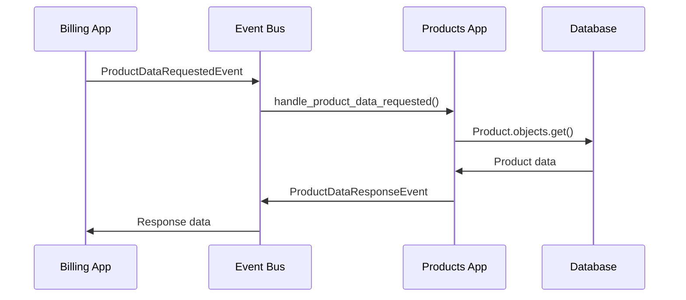
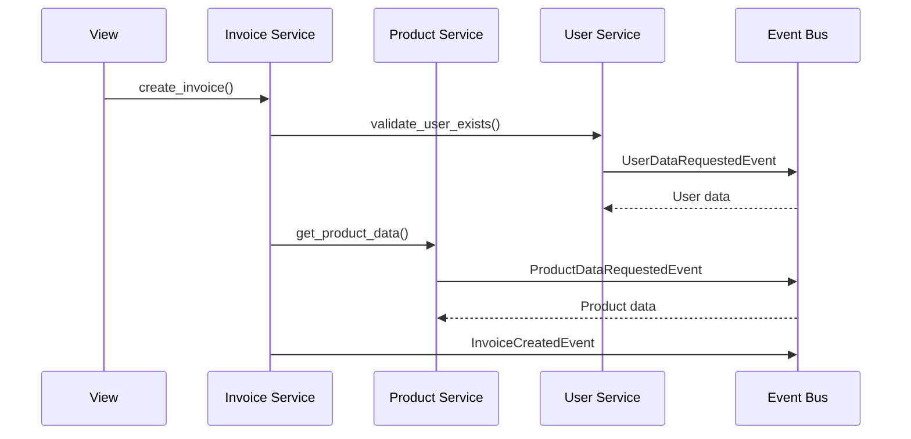

# Estándar de Comunicación Entre Apps

## Resumen

Este documento describe el estándar implementado para la comunicación entre aplicaciones (apps) en el sistema, siguiendo los principios de **Domain-Driven Design (DDD)** y **Event-Driven Architecture (EDA)**.

## Arquitectura General

### Principios Fundamentales

1. **Desacoplamiento**: Las apps no dependen directamente entre sí
2. **Comunicación por Eventos**: Uso de eventos para comunicación asíncrona y síncrona
3. **Patrón Repository**: Acceso a datos a través de repositorios
4. **Service Layer**: Lógica de negocio encapsulada en servicios
5. **Event Handlers**: Manejo de eventos para comunicación entre dominios

## Estructura de Eventos

### Eventos Base

```python
# events/events/base_event.py
@dataclass
class DomainEvent(ABC):
    event_id: str
    event_type: str
    timestamp: datetime
    metadata: Dict[str, Any]
    
    @abstractmethod
    def get_aggregate_id(self) -> str:
        pass
```

### Eventos de Solicitud de Datos

```python
# events/events/data_request_events.py
@dataclass
class DataRequestEvent(DomainEvent):
    source_app: str
    target_app: str
    requested_by: str
    request_id: str

@dataclass
class DataResponseEvent(DomainEvent):
    original_request_id: str
    source_app: str
    target_app: str
    data: Dict[str, Any]
    success: bool
    error_message: Optional[str] = None
```

## Event Bus

### Funcionalidades

- **Publicación de eventos**: `event_bus.publish(event)` (`events/bus.py`)
- **Suscripción a eventos**: `event_bus.subscribe(event_type, handler)`
- **Comunicación síncrona**: `event_bus.publish_and_wait(event, timeout)`
- **Respuestas a solicitudes**: `event_bus.respond_to_request(request_id, response)`
- **Integración con Webhooks**: `apps.integrations.tasks.process_integration_message` transforma mensajes en `IntegrationInboundEvent`/`IntegrationOutboundEvent` y los despacha.
- **Registro de Handlers**: `apps.integrations.router.registry.register(integration, event_type)` permite inyectar lógica específica por conector (ej. Alegra).

## Servicios por Dominio

### Estructura de Servicios

Cada app tiene servicios específicos para obtener datos de otras apps:

```
apps/
├── billing/
│   └── services/
│       ├── invoice_service.py      # Lógica de facturas
│       ├── product_service.py      # Obtener datos de productos
│       ├── tax_service.py          # Obtener datos de taxes
│       └── user_service.py         # Obtener datos de usuarios
├── products/
│   └── services/
│       └── user_service.py         # Obtener datos de usuarios
└── users/
    └── handlers.py                 # Responder solicitudes de datos
```

### Ejemplo de Servicio

```python
# apps/billing/services/product_service.py
class ProductService:
    @staticmethod
    def get_product_data(product_id: UUID, requested_fields: Optional[List[str]] = None) -> Dict[str, Any]:
        try:
            event = ProductDataRequestedEvent(
                source_app='billing',
                target_app='products',
                requested_by='billing',
                request_id=str(UUID.uuid4()),
                product_id=product_id,
                requested_fields=requested_fields
            )
            
            response = event_bus.publish_and_wait(event, timeout=10)
            
            if response and response.success:
                return response.data.get('product', {})
            else:
                return ProductService._get_fallback_product_data(product_id)
                
        except Exception as e:
            return ProductService._get_fallback_product_data(product_id)
```

## Handlers de Eventos

### Estructura de Handlers

```python
# apps/products/handlers.py
class ProductDataHandler:
    @staticmethod
    def handle_product_data_requested(event: ProductDataRequestedEvent):
        try:
            Product = apps.get_model('products', 'Product')
            product = Product.objects.get(id=event.product_id)
            
            data = {
                'product': {
                    'id': str(product.id),
                    'name': product.name,
                    'price': float(product.price),
                    # ... más campos
                }
            }
            
            response = ProductDataResponseEvent(
                original_request_id=event.event_id,
                source_app='products',
                target_app=event.source_app,
                data=data,
                success=True,
                product_id=product.id
            )
            
            event_bus.respond_to_request(event.event_id, response)
            
        except Product.DoesNotExist:
            # Manejar error
            pass
```

## Flujo de Comunicación

### 1. Solicitud de Datos



### 2. Creación de Factura



## Casos de Uso Implementados

### 1. Crear Factura con Validación

```python
# En una vista
def create_invoice_with_services(request):
    invoice_service = InvoiceService()
    result = invoice_service.create_invoice(
        invoice_data=invoice_data,
        items_data=items_data,
        created_by=request.user
    )
    
    if result['success']:
        return Response({'invoice_id': str(result['invoice'].id)})
    else:
        return Response({'errors': result['errors']})
```

### 2. Obtener Datos de Producto

```python
# En un servicio
product_data = ProductService.get_product_data(product_id)
if product_data:
    price = product_data.get('price', 0)
    name = product_data.get('name', '')
```

### 3. Obtener Datos de Usuario

```python
# En un servicio
user_data = UserService.get_user_data(user_id)
user_name = UserService.get_user_name(user_id)
user_email = UserService.get_user_email(user_id)
```

## Ventajas del Estándar

### 1. **Desacoplamiento**
- Las apps no dependen directamente entre sí
- Cambios en una app no afectan a otras
- Fácil mantenimiento y testing

### 2. **Escalabilidad**
- Comunicación asíncrona permite mejor rendimiento
- Fácil agregar nuevas apps sin modificar existentes
- Soporte para microservicios

### 3. **Flexibilidad**
- Diferentes tipos de comunicación (síncrona/asíncrona)
- Manejo de errores robusto
- Datos de fallback cuando hay problemas

### 4. **Trazabilidad**
- Todos los eventos se registran
- Fácil debugging y auditoría
- Historial de comunicación

## Mejores Prácticas

### 1. **Manejo de Errores**
```python
try:
    response = event_bus.publish_and_wait(event, timeout=10)
    if response and response.success:
        return response.data
    else:
        return fallback_data()
except Exception as e:
    logger.error(f"Error: {str(e)}")
    return fallback_data()
```

### 2. **Timeouts**
```python
# Siempre usar timeouts para evitar bloqueos
response = event_bus.publish_and_wait(event, timeout=10)
```

### 3. **Datos de Fallback**
```python
@staticmethod
def _get_fallback_product_data(product_id: UUID) -> Dict[str, Any]:
    return {
        'id': str(product_id),
        'name': f'Producto {product_id}',
        'price': 0.0,
        'status': 'unknown'
    }
```

### 4. **Logging**
```python
logger.info(f"Datos de producto {product_id} obtenidos via eventos")
logger.warning(f"No se pudieron obtener datos del producto {product_id}")
logger.error(f"Error obteniendo datos de producto {product_id}: {str(e)}")
```

## Configuración

### 1. **Registro de Handlers**
```python
# En cada app/handlers.py
def register_handlers():
    event_bus.subscribe("ProductDataRequested", ProductDataHandler.handle_product_data_requested)
    event_bus.subscribe("UserDataRequested", UserDataHandler.handle_user_data_requested)

# Auto-registrar
register_handlers()
```

### 2. **Importación de Servicios**
```python
# En cada app/services/
from events.event_bus import event_bus
from events.events.data_request_events import ProductDataRequestedEvent
```

## Extensibilidad

### Agregar Nueva App

1. **Crear eventos específicos** en `events/events/`
2. **Implementar handlers** en `apps/nueva_app/handlers.py`
3. **Crear servicios** en `apps/nueva_app/services/`
4. **Registrar handlers** automáticamente

### Agregar Nuevo Tipo de Datos

1. **Crear eventos de solicitud/respuesta**
2. **Implementar handler** en la app correspondiente
3. **Crear servicio** en las apps que necesiten los datos
4. **Actualizar documentación**

## Conclusión

Este estándar proporciona una base sólida para la comunicación entre apps, siguiendo principios de DDD y EDA. Es escalable, mantenible y fácil de extender, permitiendo un desarrollo ágil y robusto del sistema.
